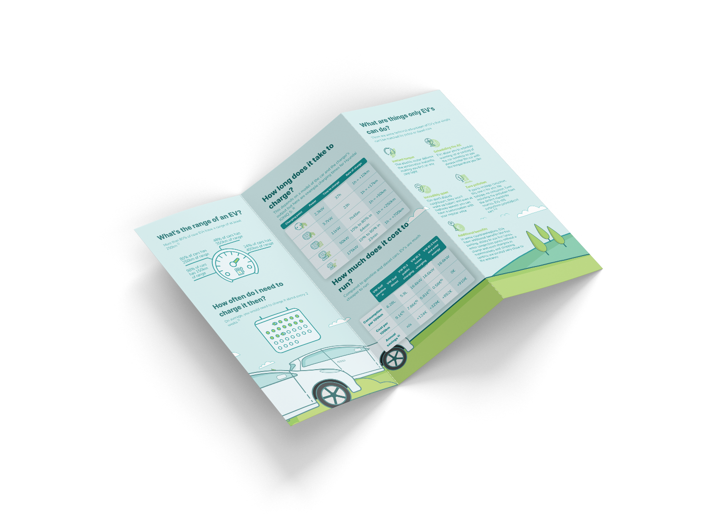

# EV FAQ
[](https://creativecommons.org/licenses/by-nc-nd/4.0/)

## Download the PDF: [🇬🇧](https://ggrn.link/ev-faq-pdf-en) [🇪🇸](https://ggrn.link/ev-faq-pdf-es) [🇵🇱](https://ggrn.link/ev-faq-pdf-pl)

A handy, printable, A4 flyer with frequently asked questions about electric vehicles. Answers things like:
* What's the range of an EV?
* How often do you need to charge an EV?
* How long does it take to charge?
* How much does it cost to run?
* What are things only EV's can do?
* How long does the battery last?

If you're constantly being asked those questions as an EV driver, feel free to print this out, and hand out to people who are interested in EV's.

## Contributing

The best way to contribute is to help with translation into other languages. If you would like to translate this flyer into your language, you can join the [translation project on POEditor](https://poeditor.com/join/project?hash=dzTB4mO8tn).

If you spot any errors or if any anything is out of date, please open an issue or a pull request.

## Building

The flyer is built with [Svelte](https://svelte.dev/) + [SvelteKit](https://kit.svelte.dev/) and rendered to PDF using [`electron-pdf`](https://github.com/fraserxu/electron-pdf).

To develop locally and preview in the browser, start a dev server with:
```
npm run dev
```
To build an actual PDF, set the desired language and run the build command:
```
export VITE_LANGUAGE=en
npm run pdf:build
```
The resulting file will be in the `build` directory.